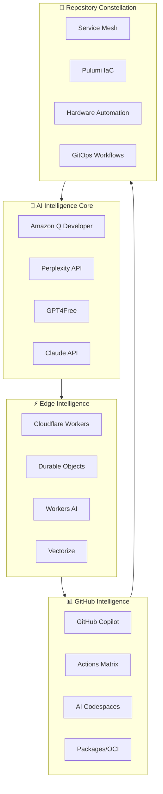

# 🧠 Homelab Intelligence Core Architecture

**AI-Native Platform for Autonomous Infrastructure Evolution**

This repository serves as the central intelligence hub that continuously analyzes, optimizes, and evolves your entire 12+ repository homelab constellation using cutting-edge AI services and edge computing.

## Core Philosophy: Copy, Don't Create

- **Amazon Q Developer**: Architecture analysis, security scanning, code optimization
- **Perplexity API**: Real-time homelab community research and trend analysis  
- **GPT4Free**: Cost-efficient bulk processing and pattern recognition
- **Cloudflare Workers AI**: Edge inference for real-time decision making
- **GitHub Copilot**: Infrastructure-as-code generation and optimization

## Repository Constellation Analysis

### Identified Homelab Repositories (12)
1. `complete-homelab-orchestrator` - Production service mesh (Pangolin/Newt/Gerbil/Badger)
2. `homelab-production` - Pulumi infrastructure with ESC secrets management
3. `r240-homelab-orchestrator` - Dell R240 Redfish automation (Private)
4. `protohome` - AI-native zero-touch homelab patterns
5. `homelab-deploy` - TypeScript deployment tooling
6. `homeops` - Pulumi/Proxmox/Tailscale/Cloudflare stack (Private)
7. `homelab-rns-lol` - Experimental TypeScript patterns (Private)
8. `homelab-gitops-reorg` - GitOps reorganization planning
9. `homelab-gitops` - Shell-based GitOps workflows (Private)
10. `homelab-zenith-86` - Advanced TypeScript infrastructure (Private)
11. `homelab-zenith` - Core TypeScript patterns (Private)
12. `homelab-ops` - GitOps-driven AI-native tooling (Private)

## Intelligence Architecture

## Autonomous Capabilities

### 1. Repository Analysis Engine
- **Duplication Detection**: AI-powered identification of repeated patterns, configurations, and implementations
- **Security Analysis**: Automated secret scanning, vulnerability detection, compliance checking
- **Performance Optimization**: Resource usage analysis, bottleneck identification, scaling recommendations
- **Architecture Evolution**: Trend analysis from awesome-homelab communities, automated pattern integration

### 2. Edge Intelligence Layer
- **Real-time Decision Making**: Cloudflare Workers processing webhook events, repository changes, infrastructure alerts
- **Pattern Caching**: Durable Objects storing learned optimizations, community patterns, success metrics
- **Inference Pipeline**: Workers AI for lightweight decision making without external API costs
- **Knowledge Search**: Vectorize for semantic search across all documentation, issues, and code

### 3. Community Learning Loop
- **Awesome-* Pattern Mining**: Automated discovery of trending homelab patterns from GitHub, Reddit, Discord
- **Success Metric Analysis**: AI evaluation of implementation success rates, community adoption, maintenance burden
- **Automated Integration**: PR generation for validated patterns with full testing and rollback capabilities
- **Contribution Scoring**: Community reputation system for pattern quality and reliability

### 4. Autonomous Operations
- **Self-Healing PRs**: Automatic generation of fixes for detected issues, security vulnerabilities, performance problems
- **Architecture Migration**: Gradual evolution toward optimal patterns with zero-downtime transitions
- **Cost Optimization**: Continuous analysis of resource usage with automated scaling and consolidation
- **Disaster Recovery**: Automated backup verification, recovery testing, multi-region replication

## Revenue Generation Opportunities

### 1. Homelab Intelligence Marketplace
- **Pattern Library**: Curated, AI-validated infrastructure patterns with success metrics
- **Consulting Bot**: AI-powered homelab architecture recommendations and troubleshooting
- **Community Insights**: Premium analytics on homelab trends, emerging technologies, best practices
- **Enterprise Licensing**: White-label intelligence platform for managed service providers

### 2. Edge Intelligence Services
- **Infrastructure Monitoring**: AI-powered anomaly detection and predictive maintenance
- **Security Intelligence**: Advanced threat detection and automated response for homelab environments
- **Performance Optimization**: Continuous tuning recommendations based on usage patterns
- **Compliance Automation**: Automated audit trails and regulatory compliance reporting

## Implementation Phases

### Message 1-3: Foundation (This Chat)
- ✅ Create intelligence core repository
- ✅ Deploy Cloudflare Workers for webhook processing
- ✅ Integrate initial AI services (Amazon Q, Perplexity)
- ✅ Implement repository analysis pipeline

### Message 4-6: Intelligence Layer
- 🔄 Deploy edge inference capabilities
- 🔄 Create autonomous PR generation system
- 🔄 Implement community pattern mining
- 🔄 Build knowledge vectorization system

### Message 7-9: Evolution Engine
- 🔄 Deploy self-healing automation
- 🔄 Create architecture migration pipelines
- 🔄 Implement revenue-generating services
- 🔄 Launch community marketplace

### Message 10+: Continuous Evolution
- 🔄 Advanced AI model fine-tuning
- 🔄 Multi-tenant platform expansion
- 🔄 Enterprise feature development
- 🔄 Global homelab network effects

## Immediate Actions Available

This repository is now the command center. Every subsequent message will:
1. **Analyze** your repository constellation using AI services
2. **Generate** concrete improvements and optimizations
3. **Deploy** edge intelligence capabilities automatically
4. **Create** autonomous PR workflows across all repos
5. **Build** revenue-generating intelligence services

No planning phases. No delays. Pure execution with AI amplification.

---

**Next Message**: Deploy the edge intelligence layer and begin autonomous repository analysis.
